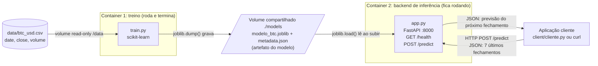
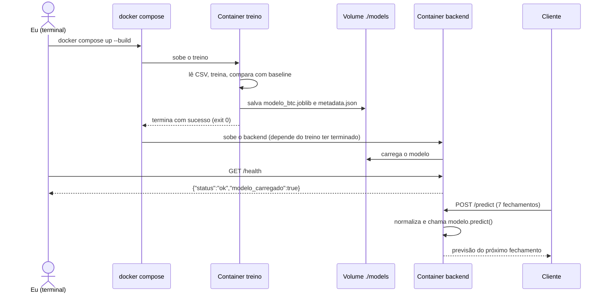

# Atividade ponderada M7 - Predição de Bitcoin com Docker

&emsp;Nessa atividade eu montei uma solução com dois containers: um que treina um modelo pra estimar o fechamento do Bitcoin do dia seguinte, e outro que carrega esse modelo e responde pedidos de predição por uma API em Python.

&emsp;OBS: a predição não é recomendação de investimento e nem dá pra confiar nela de verdade.

## Estrutura de pastas

```
ponderada-m7-moeda/
├── README.md             
├── docker-compose.yml     <- sobe treino + backend juntos
├── docs/
│   └── arquitetura.md     <- diagramas UML (mermaid)
├── data/
│   ├── baixar_btc.py      <- script que baixa o histórico
│   └── btc_usd.csv        <- dados (date, close, volume)
├── training/
│   ├── Dockerfile
│   ├── requirements.txt
│   └── train.py           <- treina e salva o modelo
├── models/                <- onde o modelo treinado é salvo (volume compartilhado)
├── backend/
│   ├── Dockerfile
│   ├── requirements.txt
│   └── app.py             <- API FastAPI (/health e /predict)
└── client/
    └── cliente.py         <- aplicação cliente que chama o backend
```

## Entendimento da solução

&emsp;O desafio pedia basicamente 4 peças conversando: ambiente de treino, o artefato do modelo, o container de inferência e uma aplicação cliente. O que eu entendi é que o treino e a inferência são coisas separadas, dois containers. O treino roda uma vez e termina, o resultado dele é um arquivo (o artefato), e a API só pega esse arquivo pronto e fica respondendo pedidos.

&emsp;O ponto que o professor pediu pra explicar é como o modelo chega no segundo container. Eu resolvi isso com um **volume do Docker compartilhado** (`./models`): o container de treino grava o `modelo_btc.joblib` lá, e o backend lê da mesma pasta quando sobe. Assim o modelo não fica "assado" dentro da imagem, e se eu treinar de novo é só reiniciar o backend.

## Diagramas

### Diagrama de componentes



&emsp;**Como o modelo chega no container de inferência:** os dois containers montam a mesma pasta `./models` como volume. O container de treino grava o arquivo lá e o backend lê de lá quando sobe. O modelo não fica dentro da imagem do backend.

### Diagrama de sequência



&emsp;O `docker compose` orquestra o processo garantindo que o backend de inferência só seja iniciado **depois** que o container de treino finalizar seu trabalho com sucesso. Primeiro o modelo é treinado e salvo no volume compartilhado; só então a API sobe, carrega esse modelo recém-criado e fica rodando continuamente para responder às requisições (`/health` e `/predict`) do cliente.

## Os dados

&emsp;Usei o histórico diário de **BTC-USD** do Yahoo Finance, de 2020-01-01 até o dia 2026-05-10. O CSV tem três colunas: `date`, `close` (preço de fechamento) e `volume`.

&emsp;Baixei com o script `data/baixar_btc.py` (usa a biblioteca `yfinance`) e salvei como CSV dentro do repositório. Fiz isso pra ganhar tempo e pra o treino não depender de internet: o container de treino só lê o arquivo, não precisa baixar nada.

&emsp;Pra gerar de novo:

```bash
pip install yfinance pandas
python data/baixar_btc.py
```

&emsp;**A tarefa de previsão:** dado os fechamentos dos últimos 7 dias, estimar o fechamento do dia seguinte.

&emsp;**Treino e teste:** como é série temporal, separei de forma cronológica: os primeiros 80% dos dias treinam e os 20% mais recentes testam. Não embaralhei nada, senão o modelo "veria o futuro" no treino.

## Devlog

### Etapa 1 - Entender o desafio e desenhar a arquitetura 

&emsp;**O que eu fiz:** li o enunciado e separei o que era obrigatório: treino em Docker ou notebook, um segundo container com backend em Python, uma rota de predição e uma forma de checar se o serviço está vivo.

&emsp;**Decisões:**
- **Dois containers separados** (treino e backend). O treino roda e termina; o backend fica de pé. Faz sentido porque são ciclos de vida diferentes.
- **Volume compartilhado `./models`** pra passar o modelo de um container pro outro. Considerei copiar o modelo pra dentro da imagem do backend, mas aí cada novo treino exigiria rebuild da imagem.
- **FastAPI** no backend, porque valida a entrada sozinho e gera a página `/docs`.
- **Previsão:** fechamento do dia seguinte, olhando os 7 últimos dias.

&emsp;**Evidência:** diagrama UML em [`README.md`](README.md).

&emsp;**Uso de IA:** pedi ajuda pra IA pra organizar a estrutura de pastas e montar o mermaid do diagrama. Eu revisei pra ver se estava batendo com o que eu tinha pensado (principalmente a parte do volume).

### Etapa 2 - Dados

&emsp;**O que eu fiz:** baixei o histórico diário de BTC-USD do Yahoo Finance com o `data/baixar_btc.py` e salvei em `data/btc_usd.csv`.

&emsp;**Decisões:** guardei o CSV no repositório pra o treino não depender de internet e pra qualquer pessoa conseguir reproduzir com os mesmos dados.

&emsp;**Teste:** conferi o arquivo depois de baixar:

```bash
head -5 data/btc_usd.csv
date,close,volume
2020-01-01,7200.17431640625,18565664997
2020-01-02,6985.47021484375,20802083465
2020-01-03,7344.88427734375,28111481032
2020-01-04,7410.65673828125,18444271275
```

```bash
wc -l data/btc_usd.csv
2471 data/btc_usd.csv
```

&emsp;**Dificuldade:** Nessa etapa, gerar o csv não me gerou dúvidas

&emsp;**Uso de IA:** a IA escreveu o script de download pra ganhar tempo. O que eu entendi: ele baixa preço diário, fica só com data, fechamento e volume, e salva em CSV.

### Etapa 3 - Treino e exportação do modelo

&emsp;**O que eu fiz:** escrevi/revisei o `training/train.py`, o `requirements.txt` e o `Dockerfile` responsável pelo ambiente de treinamento. A ideia foi deixar o treinamento reproduzível dentro de um container Docker, lendo os dados da pasta `data/` e salvando o modelo treinado na pasta `models/`.

&emsp;**Decisões:**

* Janela de 7 dias, dividida pelo último preço. Dessa forma, o modelo aprende a variação do preço em relação ao valor mais recente, em vez de trabalhar diretamente com o valor absoluto do dólar.
* Split cronológico 80/20, sem embaralhar os dados. Como se trata de uma série temporal, mantive a ordem dos acontecimentos para evitar que dados do futuro fossem usados no treinamento de forma indevida.
* Dois modelos foram comparados: Ridge e Random Forest.
* Também foi utilizado o baseline "amanhã = hoje", que serve como uma referência simples para verificar se os modelos realmente conseguem melhorar uma previsão muito básica.
* O modelo escolhido foi salvo em formato `joblib`, adequado para modelos do scikit-learn.
* Também foi definido o salvamento de um `metadata.json`, contendo informações como a janela utilizada e as métricas, para que o backend saiba como utilizar o artefato posteriormente.

&emsp;**Primeira tentativa de execução:**

&emsp;Inicialmente tentei executar o treinamento pelo Git Bash:

```bash
docker run --rm \
  -v "$(pwd)/data:/data:ro" \
  -v "$(pwd)/models:/models" \
  treino-btc
```

&emsp;O container iniciou, mas o treinamento apresentou:

```text
Traceback (most recent call last):
  File "/app/train.py", line 93, in <module>
    main()
  File "/app/train.py", line 41, in main
    df = pd.read_csv(DATA_PATH, parse_dates=["date"]).sort_values("date")
...
FileNotFoundError: [Errno 2] No such file or directory: '/data/btc_usd.csv'
```

&emsp;A primeira interpretação foi que o arquivo CSV não existia ou não estava sendo montado corretamente dentro do container. Verifiquei a pasta `data/` diretamente no terminal:

```bash
ls data/
```

&emsp;A saída foi:

```text
baixar_btc.py
btc_usd.csv
```

&emsp;Ou seja, o arquivo existia no meu computador e estava com o nome correto. Isso indicou que o problema não estava no dataset, mas na forma como o diretório estava sendo montado no container.

&emsp;Também percebi que haviam surgido pastas com nomes estranhos, como `data;C` e `models;C`. Isso indicava um problema na interpretação dos caminhos do Windows pelo Git Bash ao utilizar `$(pwd)` nos volumes do Docker.

&emsp;**Tentativa de corrigir o caminho pelo Git Bash:**

&emsp;Tentei passar os caminhos do Windows explicitamente:

```bash
docker run --rm \
  -v "C:/Users/Isabel/OneDrive/Documentos/Inteli/2026/M07/ponderada-m7-moeda/data:/data:ro" \
  -v "C:/Users/Isabel/OneDrive/Documentos/Inteli/2026/M07/ponderada-m7-moeda/models:/models" \
  treino-btc
```

&emsp;Nesse caso, o Docker retornou:

```text
docker: Error response from daemon: mkdir C:\Users\Isabel: Access is denied.

Run 'docker run --help' for more information
```

&emsp;Esse erro mostrou que o problema estava relacionado ao acesso/montagem dos diretórios do Windows pelo Docker Desktop, e não ao código do treinamento.

&emsp;**Mudança para WSL:**

&emsp;Como eu já tinha o WSL instalado, decidi utilizar o Ubuntu integrado ao Docker Desktop em vez do Git Bash. A intenção foi executar os comandos em um ambiente Linux, evitando a conversão de caminhos do Windows feita pelo Git Bash.

&emsp;Inicialmente, porém, o Ubuntu também apresentou problemas para iniciar. Ao tentar:

```powershell
wsl -d Ubuntu
```

&emsp;recebi:

```text
<3>WSL (1676 - Relay) ERROR: CreateProcessParseCommon:999: getpwnam(isabelmontenegro) failed 5
<3>WSL (1676 - Relay) ERROR: CreateProcessParseCommon:1008: getpwuid(1000) failed 5
<3>WSL (1676 - Relay) ERROR: ConfigUpdateLanguage:2580: fopen(/etc/default/locale) failed 5
<3>WSL (1676 - Relay) ERROR: operator():519: getpwuid(0) failed 5
<3>WSL (1676) ERROR: I/O error @util.cpp:1327 (UtilInitGroups)
<3>WSL (1676 - Relay) ERROR: CreateProcessCommon:742: Create process failed
```

&emsp;Usei o GPT para me ajudar a interpretar essas mensagens do terminal e entender que o problema não estava no projeto, mas na inicialização do Ubuntu dentro do WSL. Também fui orientada sobre quais comandos utilizar para verificar o estado do WSL sem apagar a distribuição.

&emsp;Primeiro verifiquei o estado do WSL:

```powershell
wsl --status
```

&emsp;que mostrou:

```text
Distribuição Padrão: Ubuntu
Versão Padrão: 2
```

&emsp;Depois:

```powershell
wsl --list --verbose
```

&emsp;e obtive:

```text
NAME              STATE           VERSION
* Ubuntu            Running         2
  docker-desktop    Running         2
```

&emsp;Isso confirmou que eu estava utilizando **WSL 2** e que o Docker Desktop também estava rodando sobre WSL 2.

&emsp;Ainda assim, o Ubuntu continuava apresentando problemas. Tentei iniciar a distribuição como `root` para verificar se o problema estava relacionado ao usuário:

```powershell
wsl -d Ubuntu -u root
```

&emsp;mas também ocorreu:

```text
getpwnam(root) failed 5
Usuário não encontrado.
Código de erro: Wsl/WSL_E_USER_NOT_FOUND
```

&emsp;Depois, com orientação do GPT, encerrei a distribuição e atualizei o WSL:

```powershell
wsl --terminate Ubuntu
wsl --update
```

&emsp;O comando `wsl --terminate Ubuntu` encerra especificamente a distribuição Ubuntu que estava com problema, enquanto `wsl --update` verifica/atualiza os componentes do WSL.

&emsp;Também foi necessário reiniciar o computador para que a atualização e as alterações no ambiente fossem aplicadas.

**Resultado após a atualização:**

&emsp;Depois de reiniciar o computador, abri novamente o Docker Desktop, esperei o serviço iniciar e testei:

```powershell
wsl -d Ubuntu
```

&emsp;Dessa vez o Ubuntu iniciou corretamente:

```text
isabelmontenegro@Isabel-0515:/mnt/c/Users/Inteli$
```

&emsp;Com isso, passei a executar os comandos pelo WSL.

&emsp;**Execução do treinamento pelo WSL:**

&emsp;Dentro do Ubuntu, acessei a pasta do projeto:

```bash
cd "/mnt/c/Users/Isabel/OneDrive/Documentos/Inteli/2026/M07/ponderada-m7-moeda"
```

&emsp;O caminho `/mnt/c/` é a forma como o WSL acessa o disco `C:` do Windows. Dessa forma, não precisei mover ou alterar o repositório que continuou no OneDrive.

&emsp;Depois confirmei os arquivos:

```bash
ls data/
```

&emsp;que mostrou:

```text
baixar_btc.py
btc_usd.csv
```

&emsp;Também testei a comunicação com o Docker pelo WSL:

```bash
docker version
```

&emsp;Com o Docker funcionando, executei finalmente o treinamento:

```bash
docker run --rm \
  -v "$(pwd)/data:/data:ro" \
  -v "$(pwd)/models:/models" \
  treino-btc
```

&emsp;Nesse comando:

* `docker run` cria e executa um container a partir da imagem `treino-btc`.
* `--rm` faz com que o container seja removido automaticamente depois que o treinamento termina, evitando deixar containers parados ocupando espaço.
* `-v "$(pwd)/data:/data:ro"` monta a pasta `data` do projeto dentro do container em `/data`. O `:ro` significa *read-only*, então o treinamento pode ler os dados, mas não modificá-los.
* `-v "$(pwd)/models:/models"` monta a pasta `models` do projeto em `/models`. Diferentemente de `data`, essa pasta não é somente leitura porque o treinamento precisa salvar o modelo gerado.
* `treino-btc` é a imagem Docker que havia sido construída anteriormente com o ambiente necessário para executar o treinamento.

&emsp;A execução finalmente funcionou e apresentou:

```text
[treino] 2470 linhas, de 2020-01-01 até 2026-10-05
[treino] baseline (amanhã = hoje): MAE = 1305.76 USD
[treino] ridge: MAE = 1323.11 USD
[treino] random_forest: MAE = 1352.42 USD
[treino] melhor modelo: ridge
[treino] modelo salvo em /models/modelo_btc.joblib
```

&emsp;O treinamento utilizou **2.470 registros**, cobrindo o período de **01/01/2020 a 05/10/2026**.

&emsp;Os resultados foram:

| Modelo                   |         MAE |
| ------------------------ | ----------: |
| Baseline (amanhã = hoje) | 1305,76 USD |
| Ridge                    | 1323,11 USD |
| Random Forest            | 1352,42 USD |

&emsp;Nesse caso, o **Ridge foi o melhor entre os dois modelos testados**, com MAE de `1323,11 USD`. Porém, é importante observar que o baseline apresentou MAE menor (`1305,76 USD`). Portanto, apesar de o Ridge ter sido selecionado como o melhor modelo entre os modelos de ML avaliados, **ele não superou a estratégia simples de considerar que o preço de amanhã será igual ao preço de hoje**. Isso é um resultado importante da avaliação e mostra que o modelo ainda não apresenta ganho sobre uma referência muito simples.

&emsp;Ao final, o modelo foi exportado para:

```text
/models/modelo_btc.joblib
```

&emsp;Como `/models` está montado diretamente com a pasta `models` do projeto, esse arquivo fica disponível fora do container e pode ser utilizado posteriormente pelo backend.

&emsp;**Dificuldade:**

&emsp;A principal dificuldade dessa etapa foi configurar corretamente o ambiente de execução do treinamento. A primeira tentativa pelo Git Bash apresentou um `FileNotFoundError` para `/data/btc_usd.csv`, mesmo o arquivo existindo na pasta `data/`. Ao investigar, percebi que havia um problema na montagem dos volumes entre os caminhos do Windows e o Docker. Uma tentativa de passar o caminho absoluto também resultou em `Access is denied`.

&emsp;Para resolver, passei a utilizar o WSL 2, que já estava instalado e integrado ao Docker Desktop. O próprio Ubuntu, porém, apresentou erros de inicialização relacionados ao usuário e ao filesystem da distribuição. Usei o GPT para interpretar as mensagens exibidas no terminal, entender a função dos comandos e identificar uma sequência segura de diagnóstico. Verifiquei a versão e o estado do WSL com `wsl --status` e `wsl --list --verbose`, encerrei a distribuição com `wsl --terminate Ubuntu`, atualizei o WSL com `wsl --update` e reiniciei o computador. Após isso, o Ubuntu voltou a iniciar normalmente e consegui executar o Docker pelo WSL.

&emsp;Essa etapa foi importante porque, além de executar o treinamento, precisei entender a relação entre **Windows, Git Bash, WSL 2 e Docker Desktop**, principalmente a diferença na forma como os caminhos dos arquivos são interpretados e montados dentro do container.

**Uso de IA:**

&emsp;A IA gerou a base do `train.py`. Li linha por linha e os comentários no código explicam o que eu entendi.

&emsp;Como já relatado acima, utilizei o GPT para me auxiliar na configuração do ambiente, principalmente na interpretação dos erros do terminal e na identificação dos comandos necessários para configurar o WSL e o Docker.


### Etapa 4 - Backend de inferência

&emsp;**O que eu fiz:** escrevi/revisei `backend/app.py`, o `Dockerfile` do backend e o `docker-compose.yml`.

&emsp;**Decisões:**

* O modelo carrega uma vez quando o container sobe, e não a cada requisição.
* `/health` informa se o modelo foi carregado, permitindo verificar também se o volume com o modelo funcionou corretamente.
* Validação: exatamente 7 preços, todos positivos. Caso contrário, a API retorna erro `422`.
* No compose usei `depends_on` com `service_completed_successfully`, assim o backend só sobe depois que o treino termina e o arquivo do modelo já existe.
* Fixei a mesma versão do scikit-learn nos dois `requirements.txt`, porque um arquivo `.joblib` pode apresentar problemas de compatibilidade caso seja carregado com uma versão diferente da utilizada no treinamento.

&emsp;**Teste do backend isoladamente:**

&emsp;Primeiro construí a imagem do backend:

```bash
docker build -t backend-btc ./backend
```

&emsp;O build foi concluído com sucesso:

```text
[+] Building 42.6s (10/10) FINISHED
...
=> [5/5] COPY app.py .
...
=> naming to docker.io/library/backend-btc:latest
```

&emsp;O comando `docker build` lê o `Dockerfile` dentro de `backend/`, instala as dependências definidas no `requirements.txt`, copia o `app.py` para a imagem e, ao final, cria a imagem `backend-btc`.

&emsp;Depois executei o container:

```bash
docker run --rm -p 8000:8000 \
  -v "$(pwd)/models:/models:ro" \
  backend-btc
```

&emsp;A saída mostrou que o servidor iniciou corretamente:

```text
INFO:     Started server process [1]
INFO:     Waiting for application startup.
INFO:     Application startup complete.
INFO:     Uvicorn running on http://0.0.0.0:8000
```

&emsp;Também foi possível confirmar que o modelo treinado na etapa anterior foi encontrado e carregado:

```text
[backend] modelo carregado de /models/modelo_btc.joblib
```

&emsp;O parâmetro `-p 8000:8000` fez a porta `8000` do container ficar acessível pela porta `8000` da máquina. Já o volume `-v "$(pwd)/models:/models:ro"` disponibilizou a pasta `models` dentro do container em `/models`, em modo somente leitura.

&emsp;Após iniciar o backend, abri outro terminal WSL e testei o endpoint de saúde:

```bash
curl http://localhost:8000/health
```

&emsp;O backend registrou a requisição:

```text
172.17.0.1:56902 - "GET /health HTTP/1.1" 200 OK
```

&emsp;E o terminal retornou:

```json
{"status":"ok","modelo_carregado":true}
```

&emsp;O código `200 OK` confirma que a requisição foi processada com sucesso, enquanto `"modelo_carregado":true` confirma que a API conseguiu acessar o arquivo `modelo_btc.joblib` e carregá-lo corretamente.

&emsp;**Resultado:** o backend foi construído e executado com sucesso, o modelo foi carregado corretamente e o endpoint `/health` respondeu conforme esperado.

&emsp;**Dificuldade:** não tive dificuldades durante o teste do backend.

&emsp;**Uso de IA:** a IA gerou a base do `app.py` e do compose. Entendi o fluxo: o container sobe, carrega o modelo e o `/predict` aplica a mesma transformação utilizada no treino, dividindo os preços pelo último preço antes de chamar o `predict`.

### Etapa 5 - Integração e testes

&emsp;**O que eu fiz:** integrei o modelo treinado ao backend e realizei testes para verificar o funcionamento do sistema completo. Foram testados o carregamento do modelo, a disponibilidade da API, a realização de previsões, a comunicação com o cliente Python e a validação de entradas inválidas.

&emsp;**5.1 Subir tudo**

&emsp;Para iniciar os serviços do projeto, utilizei:

```bash
docker compose up
```

&emsp;O container responsável pelo treinamento executou o processo e apresentou:

```text
[treino] 2470 linhas, de 2020-01-01 até 2026-10-05
[treino] baseline (amanhã = hoje): MAE = 1305.76 USD
[treino] ridge: MAE = 1323.11 USD
[treino] random_forest: MAE = 1352.42 USD
[treino] melhor modelo: ridge
[treino] modelo salvo em /models/modelo_btc.joblib
treino-1 exited with code 0
```

&emsp;O treinamento foi concluído normalmente e o modelo Ridge foi salvo em `/models/modelo_btc.joblib`. Em seguida, o backend foi iniciado pelo Uvicorn:

```text
backend-1  | INFO:     Started server process [1]
backend-1  | INFO:     Waiting for application startup.
backend-1  | INFO:     Application startup complete.
backend-1  | INFO:     Uvicorn running on http://0.0.0.0:8000 (Press CTRL+C to quit)
backend-1  | [backend] modelo carregado de /models/modelo_btc.joblib
```

&emsp;A mensagem `modelo carregado de /models/modelo_btc.joblib` confirmou que o backend conseguiu acessar o artefato produzido na etapa de treinamento.

&emsp;Também foram registradas chamadas ao endpoint `/health`, todas retornando `200 OK`:

```text
backend-1  | INFO:     127.0.0.1:55990 - "GET /health HTTP/1.1" 200 OK
backend-1  | INFO:     127.0.0.1:39646 - "GET /health HTTP/1.1" 200 OK
backend-1  | INFO:     127.0.0.1:56782 - "GET /health HTTP/1.1" 200 OK
```

&emsp;Também foi registrada uma requisição de previsão processada com sucesso:

```text
backend-1  | INFO:     172.20.0.1:51628 - "POST /predict HTTP/1.1" 200 OK
```

&emsp;Esses registros confirmaram que o backend estava ativo e conseguia receber requisições.

&emsp;**5.2 Health**

&emsp;Para verificar a disponibilidade da API, utilizei:

```bash
curl http://localhost:8000/health
```

&emsp;O endpoint respondeu com sucesso, conforme indicado pelo status `200 OK` registrado nos logs do backend:

```text
"GET /health HTTP/1.1" 200 OK
```

&emsp;Esse teste foi utilizado para verificar se o servidor estava disponível antes da realização das previsões.

&emsp;**5.3 Predição**

&emsp;Com o backend disponível, realizei uma requisição diretamente ao endpoint `/predict`, utilizando sete valores de fechamento:

```bash
curl -X POST http://localhost:8000/predict \
  -H "Content-Type: application/json" \
  -d '{"ultimos_fechamentos":[60000,61000,60500,62000,63000,62500,64000]}'
```

&emsp;A resposta recebida foi:

```json
{
  "ultimo_fechamento": 64000.0,
  "previsao_proximo_fechamento": 64071.99,
  "variacao_prevista_pct": 0.11,
  "modelo": "ridge",
  "aviso": "Experimental. Não é recomendação de investimento."
}
```

&emsp;A API recebeu os sete fechamentos e retornou uma previsão de `64071.99`, partindo de um último fechamento de `64000.00`. A variação prevista foi de `0.11%`.

&emsp;O campo `"modelo": "ridge"` confirmou que a previsão foi realizada utilizando o modelo Ridge treinado na etapa anterior.

&emsp;**5.4 Cliente**

&emsp;Após os testes diretos com a API, executei o cliente Python:

```bash
python3 client/cliente.py
```

&emsp;Na primeira tentativa, o cliente apresentou:

```text
Enviando: [83622.4296875, 83553.8515625, 84853.1015625, 84497.2109375, 84763.578125, 86480.3046875, 85385.8203125]

ConnectionRefusedError: [Errno 111] Connection refused
```

&emsp;O erro `Connection refused` indicava que o cliente tentou estabelecer uma conexão com a API, mas não havia um servidor disponível naquele endereço e porta.

&emsp;Para investigar a causa, verifiquei os containers em execução:

```bash
docker ps
```

&emsp;Como não havia nenhum container ativo, utilizei:

```bash
docker ps -a
```

&emsp;A saída mostrou que os containers do projeto haviam sido encerrados:

```text
91a6e5a48b85   ponderada-m7-moeda-backend   ...   Exited (0)   ...   ponderada-m7-moeda-backend-1
8abff53b2ffd   ponderada-m7-moeda-treino    ...   Exited (0)   ...   ponderada-m7-moeda-treino-1
```

&emsp;O problema ocorreu porque eu já havia executado o `docker compose`, mas depois interrompi sua execução. Assim, quando tentei utilizar o cliente novamente, o backend não estava mais rodando para receber a requisição.

&emsp;Durante a investigação, tentei iniciar o container utilizando:

```bash
docker start backend-btc
```

&emsp;O Docker retornou:

```text
Error response from daemon: No such container: backend-btc
failed to start containers: backend-btc
```

&emsp;A mensagem indicou que não existia um container com esse nome. Ao consultar novamente `docker ps -a`, identifiquei que o container pertencente ao projeto era `ponderada-m7-moeda-backend-1`.

&emsp;Para corrigir o problema, iniciei novamente os serviços do projeto:

```bash
docker compose up
```

&emsp;O backend voltou a ser executado e apresentou:

```text
backend-1  | INFO:     Uvicorn running on http://0.0.0.0:8000 (Press CTRL+C to quit)
backend-1  | [backend] modelo carregado de /models/modelo_btc.joblib
```

&emsp;Depois disso, executei novamente o cliente:

```bash
python3 client/cliente.py
```

&emsp;A execução foi concluída com sucesso:

```text
Enviando: [83622.4296875, 83553.8515625, 84853.1015625, 84497.2109375, 84763.578125, 86480.3046875, 85385.8203125]

Resposta: {
  "ultimo_fechamento": 85385.8203125,
  "previsao_proximo_fechamento": 85573.4,
  "variacao_prevista_pct": 0.22,
  "modelo": "ridge",
  "aviso": "Experimental. Não é recomendação de investimento."
}
```

&emsp;A resposta confirmou que o cliente conseguiu enviar os dados para o backend e receber a previsão do modelo. Nesse caso, o último fechamento informado foi `85385.82` e a previsão para o próximo fechamento foi `85573.40`, com variação prevista de `0.22%`.

&emsp;**5.5 Erro de validação**

&emsp;Por fim, testei o comportamento da API ao receber uma quantidade incorreta de valores. O modelo espera exatamente sete fechamentos, então enviei apenas três:

```bash
curl -X POST http://localhost:8000/predict -H "Content-Type: application/json" -d '{"ultimos_fechamentos":[1,2,3]}'
```

&emsp;A API respondeu:

```json
{
  "detail": "Envie exatamente 7 fechamentos."
}
```

&emsp;Esse resultado confirmou que a validação de entrada está funcionando e impede que uma requisição com quantidade inadequada de dados seja processada pelo modelo.

 &emsp;**Dificuldades:**

&emsp;A principal dificuldade dessa etapa foi identificar a causa do `ConnectionRefusedError` apresentado pelo cliente. Inicialmente, o erro poderia indicar um problema na API ou na comunicação com o backend. A verificação dos containers mostrou que o serviço simplesmente não estava em execução, pois eu havia interrompido anteriormente o `docker compose`.

&emsp;Também foi necessário identificar o nome correto do container, já que tentei utilizar `backend-btc`, mas esse não era o nome do container criado pelo projeto. Após verificar os containers existentes, executei novamente o `docker compose`, restabelecendo o serviço do backend.

&emsp;Depois da correção, os testes confirmaram o funcionamento das diferentes partes do sistema: o modelo foi carregado pelo backend, a API respondeu ao health check, uma previsão foi realizada diretamente pelo `curl`, o cliente Python conseguiu consumir a API e a validação rejeitou corretamente uma entrada com apenas três fechamentos.

&emsp;**Uso de IA:** Utilizei o GPT como apoio para interpretar as mensagens exibidas pelo terminal e compreender o funcionamento das etapas de integração e comunicação entre os containers, enquanto a execução dos comandos, verificação dos resultados e correção dos problemas foram realizadas por mim.