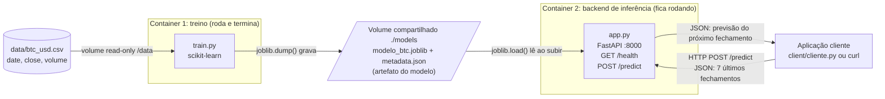
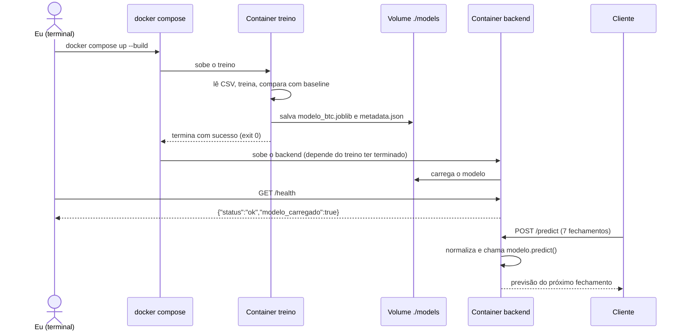

# Atividade ponderada M7 - Predição de Bitcoin com Docker

&emsp;Nessa atividade eu montei uma solução com dois containers: um que treina um modelo pra estimar o fechamento do Bitcoin do dia seguinte, e outro que carrega esse modelo e responde pedidos de predição por uma API em Python.

&emsp;OBS: a predição não é recomendação de investimento e nem dá pra confiar nela de verdade.

## Estrutura de pastas

```
ponderada-m7-moeda/
├── README.md             
├── docker-compose.yml     <- sobe treino + backend juntos
├── docs/
│   └── arquitetura.md     <- diagramas UML (mermaid)
├── data/
│   ├── baixar_btc.py      <- script que baixa o histórico
│   └── btc_usd.csv        <- dados (date, close, volume)
├── training/
│   ├── Dockerfile
│   ├── requirements.txt
│   └── train.py           <- treina e salva o modelo
├── models/                <- onde o modelo treinado é salvo (volume compartilhado)
├── backend/
│   ├── Dockerfile
│   ├── requirements.txt
│   └── app.py             <- API FastAPI (/health e /predict)
└── client/
    └── cliente.py         <- aplicação cliente que chama o backend
```

## Entendimento da solução

&emsp;O desafio pedia basicamente 4 peças conversando: ambiente de treino, o artefato do modelo, o container de inferência e uma aplicação cliente. O que eu entendi é que o treino e a inferência são coisas separadas, dois containers. O treino roda uma vez e termina, o resultado dele é um arquivo (o artefato), e a API só pega esse arquivo pronto e fica respondendo pedidos.

## Diagramas

### Diagrama de componentes



&emsp;**Como o modelo chega no container de inferência:** os dois containers montam a mesma pasta `./models` como volume. O container de treino grava o arquivo lá e o backend lê de lá quando sobe. O modelo não fica dentro da imagem do backend.

### Diagrama de sequência



&emsp;O `docker compose` orquestra o processo garantindo que o backend de inferência só seja iniciado **depois** que o container de treino finalizar seu trabalho com sucesso. Primeiro o modelo é treinado e salvo no volume compartilhado; só então a API sobe, carrega esse modelo recém-criado e fica rodando continuamente para responder às requisições (`/health` e `/predict`) do cliente.

## Os dados

&emsp;Usei o histórico diário de **BTC-USD** do Yahoo Finance, de 2020-01-01 até o dia 2026-05-10. O CSV tem três colunas: `date`, `close` (preço de fechamento) e `volume`.

&emsp;Baixei com o script `data/baixar_btc.py` (usa a biblioteca `yfinance`) e salvei como CSV dentro do repositório. Fiz isso pra ganhar tempo e pra o treino não depender de internet: o container de treino só lê o arquivo, não precisa baixar nada.

&emsp;Pra gerar de novo:

```bash
pip install yfinance pandas
python data/baixar_btc.py
```

&emsp;**A tarefa de previsão:** dado os fechamentos dos últimos 7 dias, estimar o fechamento do dia seguinte.

&emsp;**Treino e teste:** como é série temporal, separei de forma cronológica: os primeiros 80% dos dias treinam e os 20% mais recentes testam. Não embaralhei nada, senão o modelo "veria o futuro" no treino.

## Devlog

### Etapa 1 - Entender o desafio e desenhar a arquitetura 

&emsp;**O que eu fiz:** li o enunciado e separei o que era obrigatório: treino em Docker ou notebook, um segundo container com backend em Python, uma rota de predição e uma forma de checar se o serviço está vivo.

&emsp;**Decisões:**
- **Dois containers separados** (treino e backend). O treino roda e termina; o backend fica de pé. Faz sentido porque são ciclos de vida diferentes.
- **Volume compartilhado `./models`** pra passar o modelo de um container pro outro. Considerei copiar o modelo pra dentro da imagem do backend, mas aí cada novo treino exigiria rebuild da imagem.
- **FastAPI** no backend, porque valida a entrada sozinho e gera a página `/docs`.
- **Previsão:** fechamento do dia seguinte, olhando os 7 últimos dias.

&emsp;**Evidência:** diagrama UML em [`README.md`](README.md).

&emsp;**Uso de IA:** pedi ajuda pra IA pra organizar a estrutura de pastas e montar o mermaid do diagrama. Eu revisei pra ver se estava batendo com o que eu tinha pensado (principalmente a parte do volume).

### Etapa 2 - Dados

&emsp;**O que eu fiz:** baixei o histórico diário de BTC-USD do Yahoo Finance com o `data/baixar_btc.py` e salvei em `data/btc_usd.csv`.

&emsp;**Decisões:** guardei o CSV no repositório pra o treino não depender de internet e pra qualquer pessoa conseguir reproduzir com os mesmos dados.

&emsp;**Teste:** conferi o arquivo depois de baixar:

```bash
head -5 data/btc_usd.csv
date,close,volume
2020-01-01,7200.17431640625,18565664997
2020-01-02,6985.47021484375,20802083465
2020-01-03,7344.88427734375,28111481032
2020-01-04,7410.65673828125,18444271275
```

```bash
wc -l data/btc_usd.csv
2471 data/btc_usd.csv
```

&emsp;**Dificuldade:** Nessa etapa, gerar o csv não me gerou dúvidas

&emsp;**Uso de IA:** a IA escreveu o script de download pra ganhar tempo. O que eu entendi: ele baixa preço diário, fica só com data, fechamento e volume, e salva em CSV.